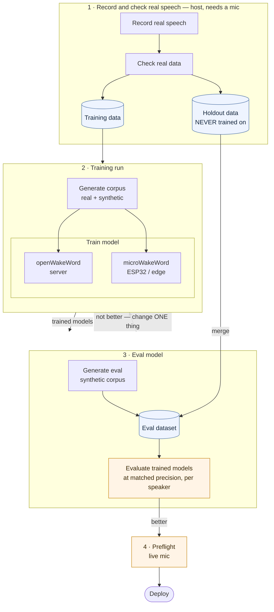

# High Level Pipeline Design



The two things this shape is built around: **the holdout leaves step 1 and goes
straight into the eval dataset**, never through training; and **evaluation feeds back
into the training run**, because that loop is the pipeline — seventeen runs of it so
far.

## File layout

```
.
├── docs/
│   └── MANUAL_RUN.md            the four steps by hand, if not using an agent
├── .claude/skills/               agent instructions, one per pipeline step
│   ├── record-samples/SKILL.md   1 · how to get usable recordings, and verify them
│   ├── write-wordlists/SKILL.md  2+3 · the phrases, the one part that does not transfer
│   └── eval-models/SKILL.md      3 · how to read a scorecard without misreading it
├── src/wordlists/                    per-wake-word phrase lists
│   ├── __init__.py               loader + the checks that keep eval and train disjoint
│   └── hey_seeree.yaml           one file per wake word
├── src/record/                       1 · record and check
│   ├── record_samples.py
│   ├── check_alignment.py
│   ├── pyproject.toml            its own uv env - kept together
│   └── uv.lock
├── src/train/                        2 · training run
│   ├── provenance.py             run tag: the commit AND the audio it trained on
│   ├── corpus/                   shared by both trainers
│   │   ├── augment.py
│   │   ├── kokoro.py             protocol client + generator (both trainers use it)
│   │   ├── negatives.py
│   │   ├── positives.py
│   │   ├── piper.py              Piper voice policy + protocol generator
│   │   └── real.py
│   ├── oww/
│   │   ├── train.py
│   │   └── onnx2tflite.py
│   └── mww/
│       ├── corpus.py
│       ├── features.py
│       ├── config.py
│       ├── train.py
│       └── manifest.py
│   ├── sweeps/                   sweep YAMLs for src/scripts/sweep.py
│   ├── patches/                  openWakeWord patches, applied by setup + Dockerfiles
│   └── train-applesilicon/ + train-mww-applesilicon/   host uv envs (below the tree)
├── src/tts-service/                  the TTS protocol and the engines that speak it:
│                                 tts_protocol/ (the client + shared audio code, what
│                                 trainers and eval depend on) and engines/ (one uv
│                                 project per engine - kokoro_mlx and piper, each its
│                                 own venv and protocol port; README.md there)
├── src/eval/                         3 · eval model - self-contained: everything the step needs
│   ├── docker-compose.yml        its own compose project, out of the base training file
│   ├── Dockerfile                CPU only, native on Apple Silicon
│   └── src/                      the harness; the image mounts it at /app/eval, keeping
│       │                         the `python -m eval.X` invocation unchanged
│       ├── paths.py              holdout vs samples - a safety property, not a convention
│       ├── generate_negatives.py builds the eval corpus
│       ├── generate_positives.py builds the eval corpus
│       ├── backends.py
│       ├── eval_model.py
│       ├── compare_models.py
│       └── check_model_alignment.py
├── src/preflight/                    4 · preflight
│   ├── test_model.py             live mic, the deployment runtime
│   ├── pyproject.toml            its own uv env - host, like src/record/
│   └── uv.lock
├── deploy/                       the current deployment candidate, staged out of
│   └── README.md                 output/ with its measured status - one at a time
├── docker/
│   ├── Dockerfile.oww.cuda       trains on an NVIDIA GPU, linux/amd64
│   ├── Dockerfile.mww.cuda       trains on an NVIDIA GPU, linux/amd64
│   ├── Dockerfile.oww.cpu        same trainer, no GPU - multi-arch, native on arm64
│   ├── Dockerfile.mww.cpu        same, on python:3.12-slim - the TF image is amd64-only
│   ├── Dockerfile.piper          piper-tts in-process (protocol 8898) in place of the
│   │                             Wyoming image the trainers no longer speak directly
│   ├── Dockerfile.kokoro         Kokoro-FastAPI + a protocol wrapper (8899), one container
│   ├── tts_engines/              the kokoro wrapper's source: kokoro_http_engine
│   │                             (the piper image bakes in src/tts-service/engines/piper)
│   └── requirements.txt          shared by BOTH oww trainers, cuda and cpu
├── src/scripts/                  the run scripts, plus the one-off measurement
│   │                              tools (audit_voices.py, bench_tts.py, tf_probe.py,
│   │                              score_margins.py, ...) folded in from the old tools/
│   ├── download-external-data.sh  -> data/external/  [all|oww|mww]
│   ├── run-oww-training.sh        2 · one command, corpus built by the run
│   ├── run-mww-training.sh        2 · four stages, corpus built separately
│   ├── start-kokoro-host.sh       Kokoro-FastAPI outside Docker - raw-API debugging
│   │                              only now (audit/bench speak the protocol);
│   │                              the Mac's training engine is the mlx one (tts-service)
│   ├── start-piper-host.sh        Wyoming host server - raw-protocol debugging only
│   │                              now; the Mac's training piper is in-process on 8898
│   ├── setup-applesilicon-trainer.sh   what Dockerfile.oww.cpu does, on the host
│   ├── run-oww-training-applesilicon.sh  2 · same trainer, no container
│   ├── setup-mww-applesilicon-trainer.sh what Dockerfile.mww.cpu does, on the host
│   └── run-mww-training-applesilicon.sh  2 · four stages, no container
├── .dockerignore                 keeps data/ (~43 GB) out of every build context
├── docker-compose.yml            no GPU required; the eval step has its own file in src/eval/
├── docker-compose.cuda.yml       overlay: NVIDIA devices - kokoro, trainers
├── docker-compose.cpu.yml        overlay: CPU trainers - Apple Silicon, or any non-NVIDIA box
├── SPEED.md                      measured timings - the evidence for the README's route calls
├── src/train/train-applesilicon/           host uv env for the oww trainer - SPEED.md
└── src/train/train-mww-applesilicon/       host uv env for the mww trainer - SPEED.md
```

The host envs are Python 3.12 uv venvs (`src/train/train-applesilicon/`,
`src/train/train-mww-applesilicon/`) and eval runs under its own pinned env; `cpython-311`/`314`
bytecode in any `__pycache__/` is from one-off interpreters and is not canonical.
