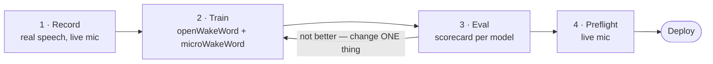

# lva-wakeword-trainer

A Docker-based wakeword training pipeline for [Linux Voice Assistant](https://github.com/OHF-Voice/linux-voice-assistant).

## The pipeline



Step 3 feeding back into step 2 is the pipeline. Most of your time is spent in that
loop, changing one thing per run. See [ARCHITECTURE.md](ARCHITECTURE.md) for what
happens inside each step.

## What you get after each run

- Two `.tflite` models, one `microwakeword` and one `openwakeword`
- A performance scorecard for each, measured under its LVA inference configuration
- Suggestions for improving the next training run (requires an AI agent pointed at this repo)


## Quick start

Open the repo in a coding agent and say what you want:

```
I want a wakeword model for "hey jarvis"
```

That is the whole starting instruction. [CLAUDE.md](CLAUDE.md) tells the agent the
order to work in, and the skills in `.claude/skills/` trigger on their own — you
should not need to name a script, a path, or a step.

It will then:

1. **Write the wordlists** for your phrase. These are the adversarial negatives built
   from your wake word's own sounds, and they are the one part that does not transfer
   between wake words.
2. **Stop and hand recording to you** — the recorder waits on ENTER and needs a person
   at a microphone. It gives you the commands, then checks what comes back: clip
   counts, levels, and where the speech sits in the detection window.
3. **Fetch the training corpora** and **run the training**, once you confirm which
   target you want. Hours, on a GPU box.
4. **Read the scorecard back to you** — per category, per speaker, at matched
   false-accept counts — and say whether it is shippable.
5. **Stop again for the live mic check**, which needs your room and your voice.

The two stops are real limits, not caution: both steps need a human speaking.

Useful things to say along the way:

```
Why does it fire on "hey serious"?
Detection is poor for my daughter. What should I do?
Compare this run against the last one.
Is this good enough to ship?
```

### Prefer to drive it yourself?

**[docs/MANUAL_RUN.md](docs/MANUAL_RUN.md)** has the four steps end to end, with the
commands for each of the three scripts in `scripts/`.


## Design choices

- **Docker only.** The pipeline is built around containers, so host-native and notebook-based training runs are explicitly unsupported.
- **A microphone and speaker are required**, for the voice capture and preflight check steps.
- **macOS is first class**, Linux is second class, and Windows is not supported.
- **GPU acceleration is optional**, and only applies to the training step.
- **Agent first.** This repo is meant to be handed to an agent or coding harness. The in-repo skills are written so an agent can drive the whole pipeline and explain the performance of the deployment candidate to you. If you have deep knowledge of how oww and mww models work, you can also refer to the [manual run docs](docs/MANUAL_RUN.md) to execute the pipeline by hand and interpret the results yourself.


## How long it takes

Three environments, all measured with `time` on the same wake word:

- **CUDA box** — RTX 3090, 20 GB RAM, 4 cores, `docker-compose.cuda.yml`
- **Mac, Docker** — M1 Max, 64 GB, 10 cores, `docker-compose.cpu.yml`, no GPU
- **Mac, host** — same Mac, no container: `scripts/*-applesilicon.sh`

| Step | CUDA box | Mac, Docker | Mac, host |
|---|---|---|---|
| Fetch external corpora | download-bound, ~43 GB for both targets | same | same |
| Record | human time, 20–50 clips per speaker | same | same |
| Train — microWakeWord | **28m03s** | **26m06s** | n/a, stays in Docker |
| Train — openWakeWord | **28m59s** | ~2h 15m | ~1h 15m (stages summed) |
| ├ Kokoro corpus | included above | ~49 min | ~49 min |
| ├ Augmentation + features | included above | ~21 min | ~21 min |
| └ Training, 50k steps | ~16 min | **~37 min** | **~5m30s** |
| Eval | minutes | minutes | minutes |
| Preflight | needs a mic | needs a mic | needs a mic |

**On Apple Silicon, leaving the container is worth ~7x on the training stage.** 250
it/s on the host against 26 in the container — same corpus, same commit, same
torch 2.5.1, only the environment differs. The macOS wheels link Accelerate and the
linux/arm64 ones do not; the container also mmaps a 16 GB feature array across
Docker Desktop's filesystem boundary, which the host reads natively. Those two have
not been separated, so treat "7x" as the combined effect rather than a claim about
either one. `apple-port.md` phase 1b has the component measurements.

**And it was not a trade against quality.** Evaluated on the same holdout, the
host-trained model beat the container-trained one at every matched false-accept
point and for every speaker - jay_runon, the largest sample at n=57, went 35% ->
51%. Two runs is not proof, and this repo has measured 10 points of run-to-run
variance before, but the direction was consistent everywhere.

**microWakeWord stays in Docker**, and the reason is the interesting part: the host
advantage is op-dependent, not general. The macOS torch build ships without oneDNN
and measured **12x SLOWER on conv1d** while winning GEMM 3x. openWakeWord's trainable
model is `Linear` x7 and one LSTM with no convolutions at all - the half that wins.
mixednet is convolutional - the half that loses. That probe was torch and mWW trains
with TensorFlow, so it points away from a host port rather than proving one would
fail; nobody has measured TF the same way, and at 26m06s there is little to chase.
Either way there is no blanket "native is faster" here.

Do not read the mww result as "the GPU is pointless" either. It is a claim about one
25,537-parameter model, too small to fill a 3090, in a run that is mostly not
training: Piper corpus generation is CPU-only on both machines by choice, since
`--use-cuda` measured 2.5x *slower*.

Figures for whole scripts are full runs at defaults - `run-mww-training.sh` covers
corpus, features, training and manifest; `run-oww-training.sh` covers TTS generation,
augmentation, training and the tflite conversion. The two targets are independent.

Four things move these numbers more than the hardware does. `SKIP_CORPUS=1` skips
corpus generation on a re-run, which is the largest single stage. `KOKORO_EXTERNAL=1`
with `scripts/start-kokoro-host.sh` takes TTS out of the container, worth 3.7x on
that stage. Docker Desktop's memory limit decides whether the 17.28 GB array is
mmap'd or thrashed, and falling short page-faults rather than erroring. And on the
CUDA box, holding the card alone is the difference between finishing and not: a
Kokoro server left up cost a run a 16.09 GiB allocation with 15.34 GiB free.